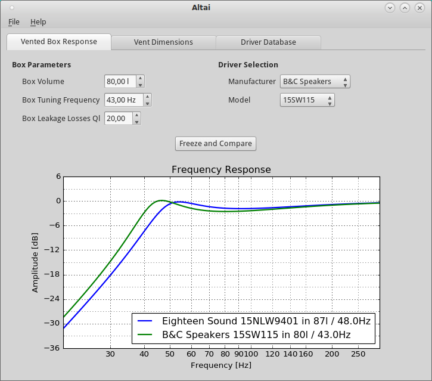

Altai --- an open-source speaker design software
================================================

Altai is an open source software for designing loudspeakers and calculating
their acoustic and electromechanical properties.

.. toctree::
   :maxdepth: 1

   installation
   contribute
   sourcedoc
